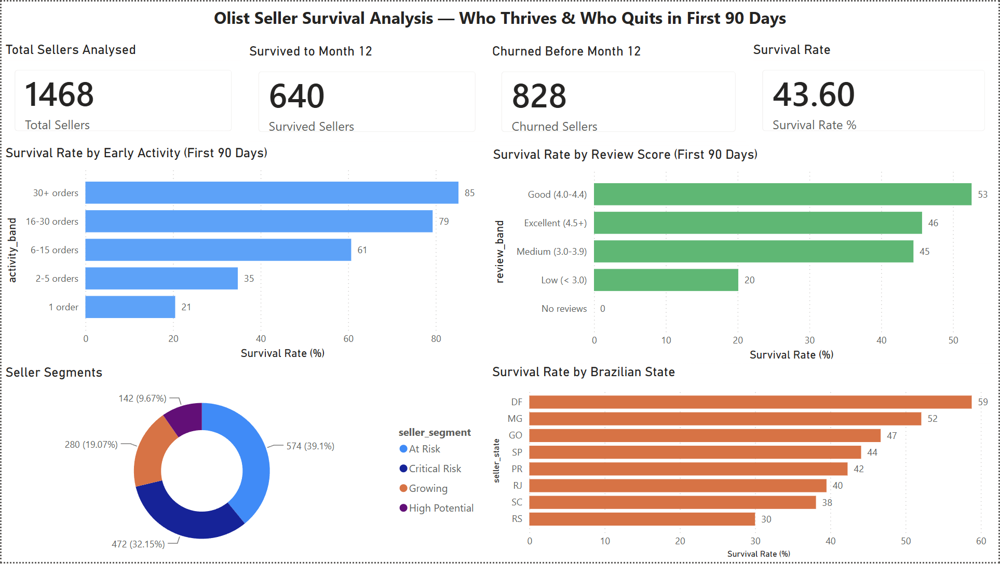

# 📦 Olist Seller Survival Analysis — Who Thrives & Who Quits
E-Commerce Seller Churn &amp; Survival Analysis — Python, Power BI

## 📊 Dashboard Preview

---

## 🎯 Business Question

What behavioural signals in a seller's first 90 days predict whether 
they will still be active at month 12?

---

## 💡 Key Findings

- 📉 Only **43.6%** of eligible Olist sellers survived to month 12 — 
more than half churned within their first year
- 🚀 Sellers making **6+ orders in their first 90 days** are **3x more 
likely to survive** than sellers making just 1 order (60.7% vs 20.5%)
- ⭐ Review score matters but is a weaker signal — sellers with scores 
of **4.0–4.4 outperform** perfect 5.0 scorers (52.6% vs 45.7%), 
suggesting consistent quality beats occasional perfection
- 🗺️ **Brasília (DF)** has the highest survival rate at **58.8%** while 
São Paulo (SP) — despite having the most sellers — sits at only 44.1%
- ⚠️ **71% of sellers fall into At Risk or Critical Risk segments** 
based on their first 90-day behaviour

---

## 🔍 Survival Rate by Early Activity

| Activity in First 90 Days | Survival Rate |
|--------------------------|---------------|
| 1 order | 20.5% |
| 2–5 orders | 34.8% |
| 6–15 orders | 60.7% |
| 16–30 orders | 79.3% |
| 30+ orders | 85.2% |

---

## 🛠️ Tools & Methods

| Layer | Tool | Purpose |
|-------|------|---------|
| Data storage | PostgreSQL | 5 tables, 400K+ rows |
| Data preparation | SQL CTEs | Seller survival table |
| Visualisation | Power BI Desktop | 4-visual dashboard |
| Dataset | Olist Brazilian E-Commerce | Kaggle open dataset |

---

## 📁 Repository Structure

02-olist-seller-survival/

├── data/

│   └── SQL query outputs

├── powerbi/

│   └── olist_seller_survival.pbix

└── images/

│   └── dashboard images

---

## 🧠 Seller Segments Defined

| Segment | Criteria | Count |
|---------|----------|-------|
| High Potential | 16+ orders AND review ≥ 4.0 | 142 (9.7%) |
| Growing | 6–15 orders AND review ≥ 3.5 | 280 (19.1%) |
| At Risk | 2–5 orders | 574 (39.1%) |
| Critical Risk | 1 order only | 472 (32.2%) |

---

## ⚠️ Assumptions & Limitations

- Only sellers whose first sale was on or before **2017-10-17** are included ensuring a full 12-month observation window
- Survival defined as having at least one order in months 10–12 after first sale
- Cancelled and unavailable orders excluded from all calculations
- Dataset covers **September 2016 to October 2018** (25 months)
- 1,468 eligible sellers out of 3,095 total (52% too new to measure)
